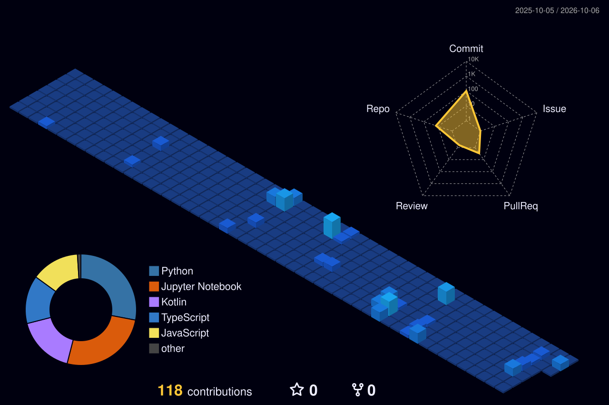

<!-- 🎬 HERO — developer stream + name -->

  

<!-- 💻 LEFT: what I build   •   🎯 RIGHT: life outside code -->

  

<!-- ⚛️ TECH STACK -->

  

<!-- 🪪 DEVELOPER ID + DASHBOARD -->

  

## 🚀 Featured builds

| Project | What it is | Stack | Status / Impact |
|:---|:---|:---|:---:|
| [**Mutual Fund Analytics Pipeline**](https://github.com/SandibJena) | High-throughput mutual fund ingestion pipeline with SQLite Star Schema, `mfapi.in` API, and quantitative risk metrics (Sharpe, Beta, Max Drawdown) @ Bluestock™ | `Python` `SQLite` `SQLAlchemy` `Pandas` | 📊 Production ETL |
| [**GYANARATNA AI Portal**](https://github.com/SandibJena) | Comprehensive state-level hackathon platform offering intelligent academic tracking and competition prep | `Next.js` `FastAPI` `Gemini API` `Tailwind` | 🥈 2nd Prize @ BPUT |
| [**Face Recognition Attendance CV**](https://github.com/SandibJena) | Automated computer vision attendance system with edge face recognition, embeddings, and live verification @ CTTC (MSME Govt. of India) | `Python` `OpenCV` `Keras` `SQLite` | 🛡️ Deployed |
| [**CALCY — Smart Android Calculator**](https://github.com/SandibJena) | Precision mathematical calculator with interactive expression tree, history logs, and Material 3 design @ Syntecxhub | `Kotlin` `Jetpack Compose` `Room DB` | 📱 Shipped |
| [**Android Expense & Budget Tracker**](https://github.com/SandibJena) | Intuitive personal finance manager with categorized expenses, charts, and reactive Room persistence | `Kotlin` `MVVM` `Room` `Coroutines` | 📱 Shipped |
| [**ResumeForge AI**](https://github.com/SandibJena) | Generative ATS resume scanner and optimization engine scoring tech resumes using LLM reasoning | `Python` `Gemini API` `Streamlit` | ⭐ Open Source |

 

## 🏙️ My contribution city

*Every commit builds another tower — rebuilt automatically every day.*

  

<!-- 💌 LET'S CONNECT -->

  

 

**Engineering data pipelines by day, shipping intelligent apps by night.** ⚡

